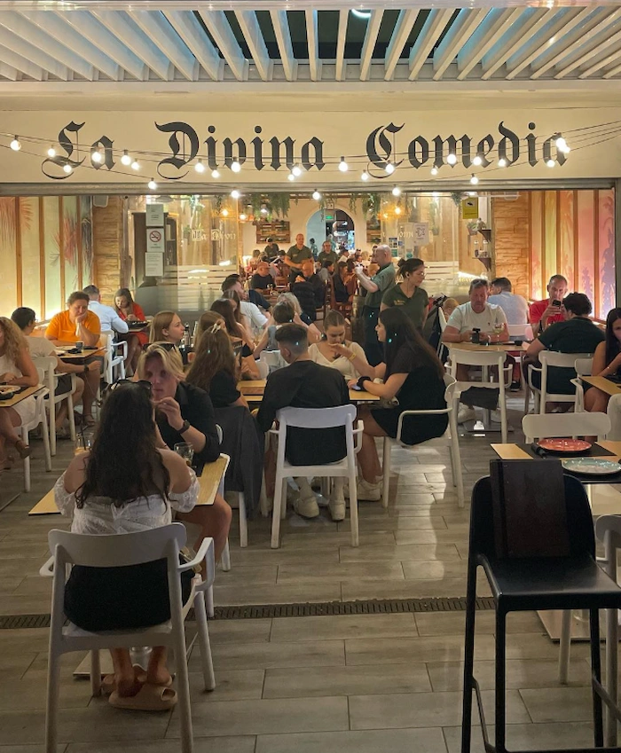
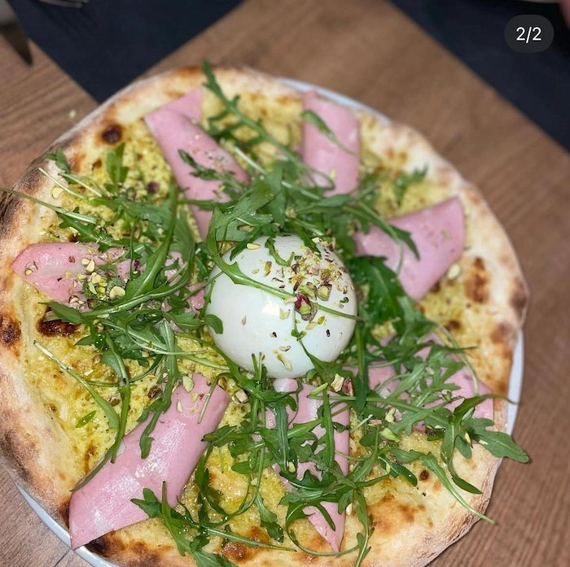

# La Divina Comedia — Sitio web 🍝🥩🥂

Proyecto web para el restaurante La Divina Comedia en la playa de la Malvarrosa (Valencia). Enfoque mobile-first con media queries para una experiencia responsive en tablets y escritorio.

## Caracteristicas 💡🧠

- Enfoque mobile-first.
- Responsive con breakpoints para tablet, desktop y pantallas grandes.
- Carrusel tactil con swipe nativo (iOS/Android), indicadores y auto-slide.
- Paginas: Inicio, Carta (ES/EN) y Reservas.
- Animaciones suaves y accesibilidad basica.
- Desplegado en Vercel.

## Tecnologias 🛠

- HTML5
- CSS3 (flex, media queries, scroll-snap)
- JavaScript (ES6) para interacciones y animaciones+

## Estructura del proyecto 📂

```
DivinaComedia/
  index.html         # Pagina de inicio
  carta.html         # Carta (ES)
  carta-en.html      # Carta (EN)
  reservas.html      # Reservas
  style.css          # Estilos globales
  scripts.js         # Logica UI (menu, carrusel, animaciones)
  img/               # Imagenes y assets estaticos
  favicon.ico        # Favicon
  CNAME              # Dominio personalizado (opcional para GitHub Pages)
```

## Imagenes 📷

### LAPTOP 💻


### TABLET ⌨


### MÓVIL 📲


## Uso en local

1. Descarga/clona el proyecto.
2. Abre `index.html` en el navegador.
3. Opcional (servidor estatico):
   - Node: `npx http-server .` o `npx serve .`
   - Python 3: `python -m http.server 8080`

## Despliegue 🚀

- GitHub Pages: publica el repo y configura Pages. Si usas dominio propio, ajusta `CNAME`.
- Alternativas: Netlify/Vercel/hosting estatico.

## Accesibilidad

- Etiquetas `alt` en imagenes.
- Contraste adecuado y tipografia legible.
- Controles con `aria-label` cuando aplica.

## Rendimiento

- Imagenes optimizadas.
- Animaciones con transformaciones/scroll-snap para mayor suavidad.
- Codigo ligero (sin frameworks pesados).

## SEO basico

- Titulos y meta etiquetas adecuadas.
- Uso de elementos semanticos.


## Licencia

Propiedad del restaurante La Divina Comedia. Uso sujeto a autorizacion.

## Capturas (placeholders)

Inserta tus imagenes en la carpeta `img/` y enlazalas asi:

```markdown




```

Si prefieres controlar el tamaño, puedes usar etiquetas HTML en el README:


Tambien puedes organizarlas en una cuadricula simple usando HTML:

```html
<p align="center">
  
  
</p>
<p align="center">
  
  
</p>
```
